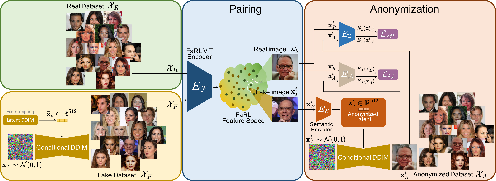
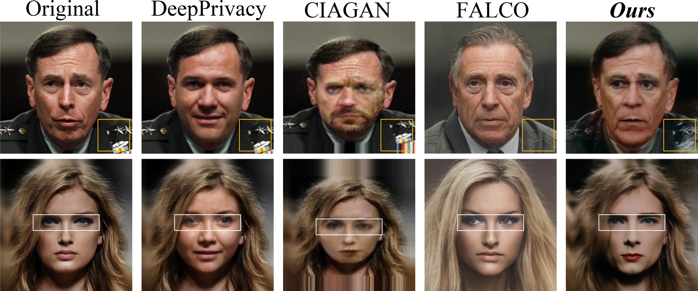

## Purpose

This project aims to reproduce the experimental section of paper DIFFUSION DE-ID: Diffusion-Based Face Dataset Anonymization.

|   |

|   |

### Prerequisites

See `requirements.txt`

```
pip install -r requirements.txt
```

### Quick start

Clone the repo to your work space.

Please download the new model params from Google Drive and put them into the folder checkpoints:

mlp model (https://drive.google.com/drive/folders/1MugUVHGn45eGklW7vJYvVjWm9eHLPRrr?usp=share_link)

attr model (https://drive.google.com/drive/folders/1fH4W9zNcxdB33N7pM3ORy2z4nDIIRwE2?usp=share_link)

Please download the model LatentMapperNew.py from disentanglement/Models/.

Download the New model LatentMapperNew1.py from '/disentanglement/Models/'.

Download the Pretrained parameter ("ID_VEC_ffhq70000_mlp.pt") from Google Drive: https://drive.google.com/file/d/10Ayh--HX_27UvOyUZDM_W-O9p0eqG6eL/view?usp=share_link

Download the new script Train_ID.ipynb. (Train Loop 1 is already done and saved in 'ID_VEC_ffhq70000_mlp.pt'. Start with Train Loop 2.)

please download the New_train.ipynb.

Run the code in New_train.ipynb.

To generate anonymization images: run_anonymization.ipynb

To evaluate: Evaluation.ipynb


