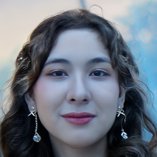

# New update (2023/05/29)
Add new file: Evaluation.ipynb

# New update (2023/05/25)
Add new file: FaRL_features_for_Pair.ipynb

# New update (2023/04/25)

This upate includes the new paper content:
1.  Environment set up + new model FaRL [https://github.com/FacePerceiver/FaRL].
2.  Experiments note book:
> 2.1 Sample.ipynb
> 2.2 Test_quality.ipynb

`Note: Back up environment first`


# New update (2023/03/19)

This update includes the resolution of the issue with backward gradient propagation, as well as a modification to the structure of the feature extractor network, which now utilizes an ID+Semantic encoder mode.

To update, please follow the steps:

0. Check the base.py. Make sure to comment out the line "with th.no_grad():":

```
    def ddim_sample_loop_progressive(
        self,
        model: Model,
        shape=None,
        noise=None,
        clip_denoised=True,
        denoised_fn=None,
        cond_fn=None,
        model_kwargs=None,
        device=None,
        progress=False,
        eta=0.0,
    ):
        """
        Use DDIM to sample from the model and yield intermediate samples from
        each timestep of DDIM.

        Same usage as p_sample_loop_progressive().
        """
        if device is None:
            device = next(model.parameters()).device
        if noise is not None:
            img = noise
        else:
            assert isinstance(shape, (tuple, list))
            img = th.randn(*shape, device=device)
        indices = list(range(self.num_timesteps))[::-1]

        if progress:
            # Lazy import so that we don't depend on tqdm.
            from tqdm.auto import tqdm

            indices = tqdm(indices)

        for i in indices:

            if isinstance(model_kwargs, list):
                # index dependent model kwargs
                # (T-1, ..., 0)
                _kwargs = model_kwargs[i]
            else:
                _kwargs = model_kwargs

            t = th.tensor([i] * len(img), device=device)
#             with th.no_grad():
            out = self.ddim_sample(
                model,
                img,
                t,
                clip_denoised=clip_denoised,
                denoised_fn=denoised_fn,
                cond_fn=cond_fn,
                model_kwargs=_kwargs,
                eta=eta,
            )
            out['t'] = t
            yield out
            img = out["sample"]

```

1. Download the New model LatentMapperNew1.py from '/disentanglement/Models/'.

2. Download the Pretrained parameter ("ID_VEC_ffhq70000_mlp.pt") from Google Drive: https://drive.google.com/file/d/10Ayh--HX_27UvOyUZDM_W-O9p0eqG6eL/view?usp=share_link

3. Download the new script Train_ID.ipynb. (Train Loop 1 is already done and saved in 'ID_VEC_ffhq70000_mlp.pt'. Start with Train Loop 2.)

# New update (2023/03/16)

Please downlaod the LatentMapperNew from /disentanglement/Models/ and replace it with the old one in your loacl folder.
Please download the New_train.ipynb. And change the model path based on your enivornment.

# New update (2023/03/15)

Please download the file id_loss.py from '/disentanglement/Losses/' and replace it with the old one in your loacl folder.

# New update (2023/03/14)

Please download the new model params from google drive and put them into the folder checkpoints:
1. mlp model (https://drive.google.com/drive/folders/1MugUVHGn45eGklW7vJYvVjWm9eHLPRrr?usp=share_link)
2. attr model (https://drive.google.com/drive/folders/1fH4W9zNcxdB33N7pM3ORy2z4nDIIRwE2?usp=share_link)

Please download the model LatentMapperNew.py from disentanglement/Models/.

please download the New_train.ipynb.

Run the code in New_train.ipynb. (If you are running the code locally, pleae ignore the colab opertations, for example, Mount drive and install all packages.)

# Official implementation of Diffusion Autoencoders

A CVPR 2022 (ORAL) paper ([paper](https://openaccess.thecvf.com/content/CVPR2022/html/Preechakul_Diffusion_Autoencoders_Toward_a_Meaningful_and_Decodable_Representation_CVPR_2022_paper.html), [site](https://diff-ae.github.io/), [5-min video](https://youtu.be/i3rjEsiHoUU)):

```
@inproceedings{preechakul2021diffusion,
      title={Diffusion Autoencoders: Toward a Meaningful and Decodable Representation}, 
      author={Preechakul, Konpat and Chatthee, Nattanat and Wizadwongsa, Suttisak and Suwajanakorn, Supasorn},
      booktitle={IEEE Conference on Computer Vision and Pattern Recognition (CVPR)}, 
      year={2022},
}
```

## Usage (  Optional: Please have a try with the inference to familiar with the code - Hanyu)

⚙️ Try a Colab walkthrough: [](https://drive.google.com/file/d/1OTfwkklN-IEd4hFk4LnweOleyDtS4XTh/view?usp=sharing)

🤗 Try a web demo: [](https://replicate.com/cjwbw/diffae)

Note: Since we expect a lot of changes on the codebase, please fork the repo before using.

### Prerequisites (  001 This is our first step - Hanyu)

See `requirements.txt`

```
pip install -r requirements.txt
```

### Quick start

A jupyter notebook.

For unconditional generation: `sample.ipynb`

For manipulation: `manipulate.ipynb`

For interpolation: `interpolate.ipynb`

For autoencoding: `autoencoding.ipynb`

Aligning your own images:

1. Put images into the `imgs` directory
2. Run `align.py` (need to `pip install dlib requests`)
3. Result images will be available in `imgs_align` directory

<table>
<tr>
<th width="33%">
Original in <code>imgs</code> directory<br>
</th>
<th width="33%">
Aligned with <code>align.py</code><br>
</th>
<th width="33%">
Using <code>manipulate.ipynb</code><br>
</th>
</tr>
</table>


### Checkpoints (  002 This is our second step, download all pretrained models - Hanyu)

We provide checkpoints for the following models:

1. DDIM: **FFHQ128** ([72M](https://vistec-my.sharepoint.com/:f:/g/personal/nattanatc_pro_vistec_ac_th/Env4aOdJJB1FqBgwAr8XPhEB6Z-CqHgDPVg8rSo2H2jk4A?e=clINeb), [130M](https://vistec-my.sharepoint.com/:f:/g/personal/nattanatc_pro_vistec_ac_th/Ej3MniHs2u9ClDEJZIK3ECkB0yzcxig70Ht8WjyFjSk4Xw?e=1HKVh3)), [**Bedroom128**](https://vistec-my.sharepoint.com/:f:/g/personal/nattanatc_pro_vistec_ac_th/EliGmm5WNbBPmSvg1aQsCA4BDmWthQpN3G0TD3n0lVHqvw?e=tPmLhQ), [**Horse128**](https://vistec-my.sharepoint.com/:f:/g/personal/nattanatc_pro_vistec_ac_th/ElAkltpC7rNCmv-btykB0GABwyPm43zaLO-xU3QOAhYIEg?e=X1n7Rh)
2. DiffAE (autoencoding only): [**FFHQ256**](https://vistec-my.sharepoint.com/:f:/g/personal/nattanatc_pro_vistec_ac_th/Ev2D_RNV2llIvm2yXyKgUxAB6w8ffg0C9NWSOtFqPMYQuw?e=f2kWUa), **FFHQ128** ([72M](https://vistec-my.sharepoint.com/:f:/g/personal/nattanatc_pro_vistec_ac_th/EjhCsOLfrxxIp280aDTucD8BlMFGhV0TB0YYIb7TsptLfw?e=uaeGHl), [130M](https://vistec-my.sharepoint.com/:f:/g/personal/nattanatc_pro_vistec_ac_th/EkFWetLoMO9GlJtox1lnOY8BARWeEgUlo1_NAkuYA9dcUQ?e=j5t9xo)), [**Bedroom128**](https://vistec-my.sharepoint.com/:f:/g/personal/nattanatc_pro_vistec_ac_th/Eruk1AX6OY1Hl46nht71tD4BCfObB0Ik90JFwry6wwyM2A?e=QCuGd1), [**Horse128**](https://vistec-my.sharepoint.com/:f:/g/personal/nattanatc_pro_vistec_ac_th/El0mTakkBllJnMgYyQHTTOAB9-VP8jJuwRvwzKEXaS7rcg?e=49GnjU)
3. DiffAE (with latent DPM, can sample): [**FFHQ256**](https://vistec-my.sharepoint.com/:f:/g/personal/nattanatc_pro_vistec_ac_th/EtYAk4GzroFFv0yxG-YOM4MBhA2i_e_RYpOHYyrcziZHIQ?e=EGxBnQ), [**FFHQ128**](https://vistec-my.sharepoint.com/:f:/g/personal/nattanatc_pro_vistec_ac_th/Ejg583SBk3JLhLp2XSpkPlkBoLeGAkJ842pK0Q1CXiseqQ?e=KYxVkZ), [**Bedroom128**](https://vistec-my.sharepoint.com/:f:/g/personal/nattanatc_pro_vistec_ac_th/EhA3tb4iR8xIt8dHcHyhPF4BZ42Nb3OWKg2HkeVsWStk4w?e=IvOzT8), [**Horse128**](https://vistec-my.sharepoint.com/:f:/g/personal/nattanatc_pro_vistec_ac_th/Eg9Ksex71kFOlFhFna4EBVIB2QdC8oR3ooV5POw-gUyOxg?e=AqAr6c)
4. DiffAE's classifiers (for manipulation): [**FFHQ256's latent on CelebAHQ**](https://vistec-my.sharepoint.com/:f:/g/personal/nattanatc_pro_vistec_ac_th/EidZBd5t375KrGPnUhcLZ10B0LPKDnQXUp8ffrsBTlPWqw?e=Frovs7), [**FFHQ128's latent on CelebAHQ**](https://vistec-my.sharepoint.com/:f:/g/personal/nattanatc_pro_vistec_ac_th/Er7et8P5-ZFOsFEFCRDgMPgBIt0jaknGAUZ9QYaSr09ljw?e=VxPKLd)

Checkpoints ought to be put into a separate directory `checkpoints`. 
Download the checkpoints and put them into `checkpoints` directory. It should look like this:

```
checkpoints/
- bedroom128_autoenc
    - last.ckpt # diffae checkpoint
    - latent.ckpt # predicted z_sem on the dataset
- bedroom128_autoenc_latent
    - last.ckpt # diffae + latent DPM checkpoint
- bedroom128_ddpm
- ...
```


### LMDB Datasets (  003 This is our third step, Download FFHQ dataset LMDB version for test - Hanyu)

We do not own any of the following datasets. We provide the LMDB ready-to-use dataset for the sake of convenience.

- [FFHQ](https://drive.google.com/drive/folders/1ww7itaSo53NDMa0q-wn-3HWZ3HHqK1IK?usp=sharing)
- [CelebAHQ](https://drive.google.com/drive/folders/1SX3JuVHjYA8sA28EGxr_IoHJ63s4Btbl?usp=sharing) 
- [CelebA](https://drive.google.com/drive/folders/1HJAhK2hLYcT_n0gWlCu5XxdZj-bPekZ0?usp=sharing) 
- [LSUN Bedroom](https://drive.google.com/drive/folders/1O_3aT3LtY1YDE2pOQCp6MFpCk7Pcpkhb?usp=sharing)
- [LSUN Horse](https://drive.google.com/drive/folders/1ooHW7VivZUs4i5CarPaWxakCwfeqAK8l?usp=sharing)

The directory tree should be:

```
datasets/
- bedroom256.lmdb
- celebahq256.lmdb
- celeba.lmdb
- ffhq256.lmdb
- horse256.lmdb
```

You can also download from the original sources, and use our provided codes to package them as LMDB files.
Original sources for each dataset is as follows: ( This is too big! Please dont. - Hanyu)

- FFHQ (https://github.com/NVlabs/ffhq-dataset)
- CelebAHQ (https://github.com/switchablenorms/CelebAMask-HQ)
- CelebA (https://mmlab.ie.cuhk.edu.hk/projects/CelebA.html)
- LSUN (https://github.com/fyu/lsun)

The conversion codes are provided as:

```
data_resize_bedroom.py
data_resize_celebhq.py
data_resize_celeba.py
data_resize_ffhq.py
data_resize_horse.py
```

Google drive: https://drive.google.com/drive/folders/1abNP4QKGbNnymjn8607BF0cwxX2L23jh?usp=sharing


## Training (  004 This is the last step for testing! See configure file for more details, modify the configure to fulfill our needs - Hanyu)

We provide scripts for training & evaluate DDIM and DiffAE (including latent DPM) on the following datasets: FFHQ128, FFHQ256, Bedroom128, Horse128, Celeba64 (D2C's crop).
Usually, the evaluation results (FID's) will be available in `eval` directory.

Note: Most experiment requires at least 4x V100s during training the DPM models while requiring 1x 2080Ti during training the accompanying latent DPM. 


**FFHQ128** (  We can start from here. - Hanyu)
```
# diffae
python run_ffhq128.py
# ddim
python run_ffhq128_ddim.py
```

A classifier (for manipulation) can be trained using:
```
python run_ffhq128_cls.py
```

**FFHQ256** (  I think this training will be too heavy. It needs 8 X V100s?! Try this later. - Hanyu)

We only trained the DiffAE due to high computation cost.
This requires 8x V100s.
```
sbatch run_ffhq256.py
```

After the task is done, you need to train the latent DPM (requiring only 1x 2080Ti)
```
python run_ffhq256_latent.py
```

A classifier (for manipulation) can be trained using:
```
python run_ffhq256_cls.py
```

**Bedroom128**

```
# diffae
python run_bedroom128.py
# ddim
python run_bedroom128_ddim.py
```

**Horse128**

```
# diffae
python run_horse128.py
# ddim
python run_horse128_ddim.py
```

**Celeba64**

This experiment can be run on 2080Ti's.

```
# diffae
python run_celeba64.py
```

